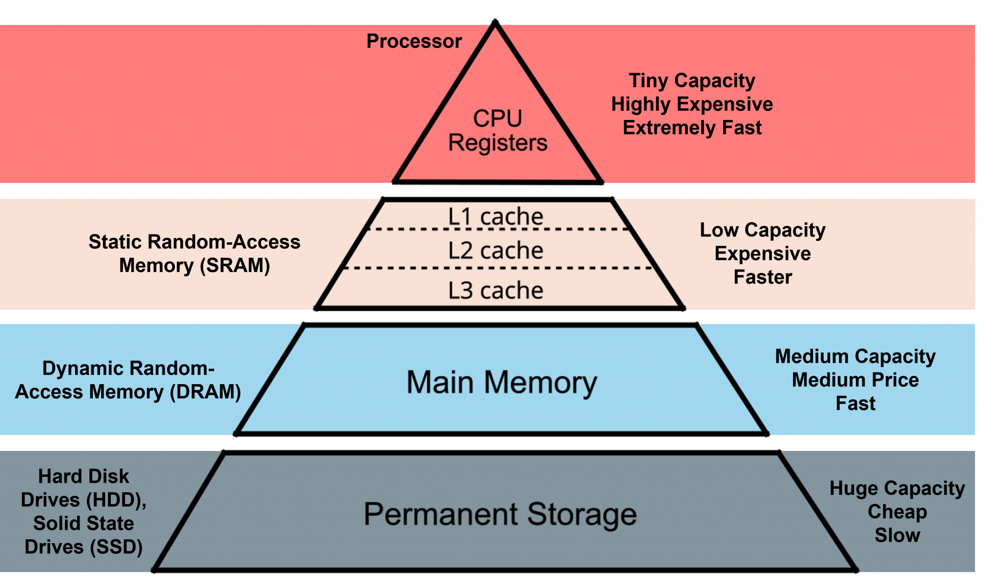

AIE4ML Project 1
====================

This repo contains development and documentation of AIE4ML project 1, [Project description](https://docs.google.com/presentation/d/1TGhn2yvmKFxDjmy0UJLweu5KbBvQz4DxouOcfj35NIc/edit#slide=id.g34ae8a4d457_0_272).

**Repo structure:**
  - `./vector-addition` contains two distinct implementations which compare the ``aie::buffer`` vs ``aie::stream`` data movement methods
  - `./matmul-single-tile` is an elementary 4x4 matrix multiplication for understanding the format of aie::mul
  - `./matmul-multi-tile` scales up the previous simple kernel to multiple tiles for parrallel processing
  - `./mmul_add_tree ` implements an addition-tree style data flow for more scalabled mult-tile matrix computation
  - `./mnist_mlp` is a simple MLP neural network quantized for int16. It uses  `mmul_add_tree` to perform dense layers.
  - `./dense_example` is an example of a dense+relu layer with 16 bit quantization on 1 AIE tile. It is more optimized and uses FPGA PL for Versal VCK 190.

AI Engine vs other Accelerators
================================

The AIE architectures were designed with Machine Learning in mind. But today most of these applcations are run on GPUs. So why would one prefer to run ML tasks on an AIE? And how would the performance compare?

The AI Engine architecture is optimized for deterministic, low-latency machine learning workloads, especially in embedded and real-time systems. Unlike GPUs, which rely on massive parallelism and dynamic scheduling, the AIE family can issue deterministic instructions for computation and data movement. This fine control in the hardware makes them ideal for edge inference tasks where latency, power efficiency, and tight coupling with pre/post-processing logic (like FPGA fabric) are critical. While AIEs won’t replace GPUs for general-purpose deep learning because of the massive parallelism required for such training and the mature development space surrounding ML for GPUs, AIEs can still perform well in embedded ML pipelines requiring tight time constraints and low power. 

For our own satisfaction we explain some of the architectural differences in more detail in the rest of this page.

The biggest difference is the Data flow emphasis. We hope you may make some sense of this here. While the AIE family uses `dataflow programming <https://en.wikipedia.org/wiki/Dataflow_programming>`_, the architecture itself is similar to that of a `dataflow architecture <https://en.wikipedia.org/wiki/Dataflow_architecture>`_. Note that *'dataflow'* term in Dataflow Programming and Dataflow Architecture are not supposed to be used in the same context, and we will not be using the latter term as the AIE is not a true dataflow architecture, but we hold that it bares similarities to one. 

And the dataflow Programming is most exemplified by how the memory is turned on its head. Instead of the regular memory hierarchy that CPU and GPU architecture hold, the AIE Tiles each hold their own memory with scratchpad memory instead. Meaning each piece of datum is given a unique address. Here's a look at the traditional memory:

  Traditional Memory Hierarchy.

  *Source: SPEAR* [#memory-hierarchy]_

And in CPUs and GPUs you can see how caches are reused and shared between cores. If memory address isn't found in cache, aka a *cache miss*, then it moves onto the next layer:

+------------------------------------------------+---------------------------------------------+
| .. figure:: images/cpu-arch.png                 | .. figure:: images/gpu-arch.png              |
|   :align: center                               |   :align: center                            |
|                                                |                                             |
|   *CPU Architecture*                           |   *GPU Architecture. Note that AMD*         |
|                                                |   *GPUs have more cache levels*             |
+------------------------------------------------+---------------------------------------------+
*Source: VMWARE* [#vmware]_

Because the architecture revolves around this idea of dataflow graphs and that data is data can be changed, produce new outputs, and sent to other kernels, the hardware reflects this nature. The hardware units, aka the AIE Tiles, perform some computation(s) and will move the data to be used by some other unit. And while this form of programming and thinking is possible on CPUs and GPUs, they are not designed around this. There's less focus on latency over thoroughput than a CPU, yet less focus on latency over throughput than a GPU. Each *tile* itself holds its own memory, and any data not stored in a tile (by either the AIE Core's registers or in the memory banks) means going off chip, or more accurately to the rest of the SoC.

  AIE-ML Tiled architecture. Note that we haven't mentioned the Memory Tiles, exclusive to the AIE-ML, but they are essentially just more AIE tiles without the compute.

  *Source: AMD Docs* [#am020]_

For example, say we want to write 2 kernels that we want to do something, say one does a computation and the second encrypts that output. In a traditional CPU and GPU architecture these kernels are loaded as instructions into the cores of their systems, and only when the first kernel is finished does the second run. Furthermore to share information in between kernels they will have to have written to a shared cache, where nearly all other cores can view and share the same info. But in the AIE we can load different kernels to neighboring tiles, and then perform our kernels on that data while sharing that data availability to a very limited amount of neighbors or specific tiles. And while it is technically possible to assign different kernels to different CPU cores/GPU, this isn't very effective or a design that is kept in mind.

----------------------
A Look In Depth
----------------------

This will compare the AIE vs other architectures in greater detail. We suggest being familiar with a University level understanding of computer architecture or equivalavently just using your browser engine to search these terms.

^^^^^^^^^^^^^^^^^^^^^^
CPUs
^^^^^^^^^^^^^^^^^^^^^^

CPUs are usually designed for low-latency and general usage. With this goal in mind, CPUs usually have multilayered memory hierarchy, anticipate instructions with branch prediction and lookahead execution, can begun to run instructions despite a stall with out-of-order execution or simultaneous multithreading, and will divvy up the instructions can execute at at time within a core's units (superscaling execution) or between cores (multicore). A CPU will employ all these techniques to lower latency and make sure the CPU is fed with instructions to run, even if that means executing a different process.

.. Would like to add to expand CPU area

^^^^^^^^^^^^^^^^^^^^^^
GPUs
^^^^^^^^^^^^^^^^^^^^^^

A GPU places a lower emphasis on latency and instead on thoroughput. This is already evident by the lower clock speeds GPUs normally have when compared to CPUs. While CPUs have a couple of cores on consumer end systems and hundreds on server systems, GPUs usually have thousands of units dedicate for processing. *Example*: The `NVIDIA GeForce RTX 4080 <https://www.techpowerup.com/gpu-specs/geforce-rtx-4080.c3888>`_ has 9728 Cuda Cores (Shading Units) and the `Radeon RX 7900 XTX <https://www.techpowerup.com/gpu-specs/radeon-rx-7900-xtx.c3941>`_ has 6144 Streaming Processors (Shading Units). These units are fundamentally much simpler that CPU cores, yet the amount of them allows for a very large amount of data to be fed through and computed. Additionally, the memory hierarchy differs a bit as well. Though there is still a memory hierarchy, there is usually some larger memory size on the lowest level on chip. On the GeForce RTX 4080 this is 128KB->64MB->16GB and on Radeon RX 7900 XTX 64KB->256KB->6MB->96MB->24GB.

.. Would like to add to expand GPU area

^^^^^^^^^^^^^^^^^^^^^^
NPUs (AMD AIE)
^^^^^^^^^^^^^^^^^^^^^^

Probably the biggest difference in compute from the AIE processors is that they are VLIW processors. Instructions can issue out 6 operations. [#ug1079]_ This allows for a single instruction to use dedicated scalar/vector units, the load and store units (AGU units), and internal register movements, essentially computing and moving data at the same time. 

  *Source: AMD Docs* [#ug1079]_

A single AIE-1 Tile. You can see the AIE processor on the left, and the AIE memory module on the right. Note that on the AIE-1, the AIE processor and the memory module are mirrored depending on the row, alternating in even and odd rows. On the AIE-MLvX, there is no alternating. All tiles are facing the same direction.

.. At this point we would like a comparison of the occupancy of our AIE units, but we don't have enough data yet for a proper comparison. At some point, the authors will add more to this section.

.. [#memory-hierarchy] https://spear-itn.eu/memory-hierarchy-how-does-computer-memory-work/
.. [#vmware] https://www.vmware.com/docs/exploring-the-gpu-architecture
.. [#ug1079] https://docs.amd.com/r/en-US/ug1079-ai-engine-kernel-coding/AI-Engine-Architecture-Overview
.. [#am020] https://docs.amd.com/r/en-US/am020-versal-aie-ml/AIE-ML-Array-Overview

Setup and Architecture Explanation
======================

----------------------
Tooling
----------------------

Before starting our programming we first want to have an idea of the architecture we're targetting and what we want to happen internally. The AMD AI Engine has a unique architecture in which different levels of parallelism that can be utilized. To show how one can bring their own kernels into the architecture, we will first explain the different components of the AI Engine. Then we will show an example for a simple AIE vector addition and how the different but similar code synthesizes onto the actual target architecture.

The AI Engine suite of tools includes a compiler and both a software and hardware emulator. Vitis itself includes features to trace signals, generate dataflow graphs, show data movement over hardware and cycle time, profile the kernel and io, and much more. While the process of compiling and emulation can be done from command line tools, to use more advanced analysis will require Vitis IDE. All of these tools are freely available for download by AMD. You will also need an AMD AIE `build license <https://www.xilinx.com/getlicenses>`_.

----------------------
Background
----------------------

The AI Engine is a `technology <https://www.amd.com/en/products/adaptive-socs-and-fpgas/technologies/ai-engine.html>`_ developed by Xilinx and then adopted by AMD after a Xilinx acquisition, finalized on Valentines Day 2022 (February 14th). [#AIE-Tech]_ [#Xilinx-Acquisition]_ It's successor, the AI Engine-ML (AIE-ML) makes a few changes to the architecture and composes AMD's NPU. This new architecture is referred to as XDNA. [#XDNA-arch]_ 

The AMD AI Engine has gone through a few iterations that change the support and architecture. As of May 2025, there are currently 3 iterations of the AIE. Confusingly, because the term *AIE* refers to a technology and the first generation of *AIE*, sometimes the AIE-ML or onwards is also referred to as an AIE. For the sake of clarity, we will refer to the AIE technology as the *AIE*, and will refer to specific versions as:

1. **AIE1**: First generation of the AIE. For clarity we refer it to AIE1, and not simply as AIE.
2. **AIE-ML**: Addition of an AIE Memory Tile. These make up XDNA.
3. **AIE-MLv2**: Second generation of AIE-ML. These make up XDNA2.

*Note: the AIE and the AIE-ML have been referred to as AIE-1 and AIE-2. But please do not use these terms.*

The AIE is integrated in AMD's CPUs (referred to as the *Ryzen AI* Series) and certain AMD *Versal* FPGA SoC. It has kept its name through the Xilinx acquisition, as *Versal* was originally given and planned by Xilinx way back in 2018. [#unveiled-versal]_ Because only certain Versal SoCs include the AIE, we include a small list of their products here. We also make an important make an important distinction that AMD's Alveo Accelerator cards are not an addition to this list, as the Alveo V80 and Alveo V70 are Versal SoCs, hence the **V** in the naming convention. [#Alveo-p-guide]_ And that the VCK5000 is another outlier.

**First Generation Versal SoC Series Table**

+------------+------------+------------+-----------+-----------------+
| Series     | Products   | AIE-Type   | Number    | Notes           |
+============+============+============+===========+=================+
| Versal     | VPK120     | N/A        | 0         | Eval Kit        |
| Premium    | VPK180     |            |           |                 |
|            +------------+------------+-----------+-----------------+
|            | VP2502     | AIE1       | 472       |                 |
|            +------------+            |           |                 |
|            | VP2802     |            |           |                 |
|            +------------+------------+-----------+                 |
|            | VP1002     | N/A        | 0         |                 |
|            | VP1052     |            |           |                 |
|            | VP1102     |            |           |                 |
|            | VP1202     |            |           |                 |
|            | VP1402     |            |           |                 |
|            | VP1502     |            |           |                 |
|            | VP1552     |            |           |                 |
|            | VP1702     |            |           |                 |
|            | VP1802     |            |           |                 |
|            | VP1902     |            |           |                 |
+------------+------------+------------+-----------+-----------------+
|            | VEK280     | AIE-ML     | 304       | Eval Kit        |
| Versal     +------------+------------+-----------+-----------------+
| AI Edge    | VE2002     | AIE-ML     | 8         |                 |
|            +------------+            +-----------+                 |
|            | VE2102     |            | 12        |                 |
|            +------------+            +-----------+                 |
|            | VE2202     |            | 24        |                 |
|            +------------+            +-----------+                 |
|            | VE2302     |            | 34        |                 |
|            +------------+            +-----------+                 |
|            | VE2602     |            | 152       |                 |
|            +------------+            +-----------+                 |
|            | VE2802     |            | 304       |                 |
|            +------------+------------+-----------+                 |
|            | VE1752     | AIE1       | 304       |                 |
+------------+------------+------------+-----------+-----------------+
|            | VR1602     | AIE1       | 126       |                 |
| Versal     +------------+            |           |                 |
| RF         | VR1652     |            |           |                 |
|            +------------+            +-----------+                 |
|            | VR1902     |            | 120       |                 |
|            +------------+            |           |                 |
|            | VR1952     |            |           |                 |
+------------+------------+------------+-----------+-----------------+
| Versal     | VCK190     | AIE1       | 400       | Eval Kit        |
| AI Core    +------------+------------+-----------+-----------------+
|            | VC1502     | AIE1       | 198       |                 |
|            +------------+------------+-----------+                 |
|            | VC1702     | AIE1       | 304       |                 |
|            +------------+------------+-----------+                 |
|            | VC1802     | AIE1       | 300       |                 |
|            +------------+------------+-----------+                 |
|            | VC1902     | AIE1       | 400       |                 |
|            +------------+------------+-----------+                 |
|            | VC2602     | AIE-ML     | 152       |                 |
|            +------------+------------+-----------+                 |
|            | VC2802     | AIE-ML     | 304       |                 |
|            +------------+------------+-----------+-----------------+
|            | ???        | AIE-MLv2   | 0         | Discontinued    |
|            | Alveo v70  |            |           |[#v70-product]_  |
|            |            |            |           | Product details |
|            |            |            |           | are dubious     |
|            +------------+------------+-----------+-----------------+
|            | VC1902     | AIE1       | 400       | VCK5000         |
|            |            |            |           | (Eval Board)    |
|            |            |            |           | [#Galapagos]_   |
+------------+------------+------------+-----------+-----------------+
|            | VMK180     | N/A        | 0         | Eval kit        |
| Versal     +------------+------------+-----------+-----------------+
| Prime      | VM1102     | N/A        | 0         |                 |
|            | VM1302     |            |           |                 |
|            | VM1402     |            |           |                 |
|            | VM1502     |            |           |                 |
|            | VM1802     |            |           |                 |
|            | VM2152     |            |           |                 |
|            | VM2202     |            |           |                 |
|            | VM2302     |            |           |                 |
|            | VM2502     |            |           |                 |
|            | VM2902     |            |           |                 |
+------------+------------+------------+-----------+-----------------+
|            | VHK158     | N/A        | 0         | Eval kit        |
| Versal     +------------+------------+-----------+-----------------+
| HBM        | VM1102     | N/A        | 0         |                 | 
|            | VM1302     |            |           |                 |
|            | VM1402     |            |           |                 |
|            | VM1502     |            |           |                 |
|            | VM1802     |            |           |                 |
|            | VM2152     |            |           |                 |
|            +------------+------------+-----------+-----------------+
|            | XCV80      | N/A        | 0         | Alveo V80       |
+------------+------------+------------+-----------+-----------------+
[#versal]_                                                           
[#Alveo-vck5000-disc]_

Discontinuation notice of FPGA boards. [#Alveo-vck5000-disc]_
                                                                     
**Second Generation Versal SoC Series Table**                        
                                                                     
+------------+------------+------------+-----------+-----------------+
| Series     | Products   | AIE-Type   | Number    | Notes           |
+============+============+============+===========+=================+
| Versal     | 2VP3102    | N/A        | 0         |                 |
| Premium    | 2VP3202    |            |           |                 |
| Gen 2      | 2VP3402    |            |           |                 |
|            | 2VP3602    |            |           |                 |
+------------+------------+------------+-----------+-----------------+
|            | 2VE3304    | AIE-MLv2   | 24        | "The Versal AI  |
| AI Edge    | 2VE3358    |            |           | Edge Series Gen |
| Gen 2      +------------+            +-----------+ 2 is currently  |
|            | 2VE3504    |            | 96        | in Early        |
|            +------------+            |           | Access."        |
|            | 2VE3558    |            |           | [v-edge-gen2]_  |
|            +------------+            +-----------+                 |
|            | 2VE3804    |            | 144       |                 |
|            +------------+            |           |                 |
|            | 2VE3858    |            |           |                 |
+------------+------------+------------+-----------+-----------------+
| Versal     | 2VM3358    | N/A        | 0         |                 |
| Prime      | 2VM3558    |            |           |                 |
| Gen 2      | 2VM3654    |            |           |                 |
|            | 2VM3858    |            |           |                 |
+------------+------------+------------+-----------+-----------------+
[#versal]_

*Again, other Alveo cards are not included since they are not Versal*. 

A much more reliable method to inspect the number and generation of AIE is to open up Vitis, select your target, and open an Array View. Considering the high number of SoC variations and different boards there is likelihood of a mistake or of a missing entry.

CPUs are much easier. AIE in this context is always an NPU, from either architecture XDNA or XDNA2. These different architectures use either AIE-ML or AIE-MLv2 respetively. 

AMD makes this list of AMD Ryzen AI CPUs so much easier to find. The generations to have NPUs are Ryzen 7040 (*"Phoenix"*), Ryzen 8040 (*"Hawk Point"*), and Ryzen 300 (*"Strix Point*"). [#adv-ai-keynote]_ . Additionally, there are also mentions of Krackan Point, a mobile APU [#krackan]_ .You can view a complete list of processors that have an NPU at `AMD Ryzen AI <https://www.amd.com/en/products/processors/consumer/ryzen-ai.html>`_. 

+---------------+------------+-----------+---------------------+
| Series        | AIE-Type   | Number    | Notes               |
+===============+============+===========+=====================+
| Ryzen AI 7040 | AIE-ML     | 16        |                     |
| (Phoenix)     |            |           | NPU XDNA Arch.      |
+---------------+            |           |                     |
| Ryzen AI 8040 |            |           |                     |
|(Hawk Point)   |            |           |                     |
+---------------+------------+-----------+---------------------+
| Ryzen AI 300  | AIE-MLv2   | 32        | (Including          |
|               |            |           | Ryzen AI            |
| (Strix Point) |            |           | Max)                |
|               |            |           | NPU XDNA2 Arch.     |
|               |            |           |                     |
+---------------+------------+-----------+---------------------+

----------------------
Architecture Differences
----------------------

Since the naming scheme does little distinguate the differences accross versions, we've dedicated a section to explain the differences.

+------------------------+-----------------------+-----------------------+-----------------------------+
|      Feature           | AIE1 Tile             | AIE-ML Tile           | AIE-MLv2 Tile (Lack of Doc) |
+========================+=======================+=======================+=============================+
|      Clock Speed [*]_  | 1GHz                  | 1 GHz                 | ??                          |
+------------------------+-----------------------+-----------------------+-----------------------------+
|   Per Tile Data Memory | 32 KiB                | 64 KiB + (125-750     | ??                          |
|                        | 4 Memory banks        | KiB Shared)           |                             |
|                        |                       | 8 Memory banks        |                             |
|                        |                       | shared w/3 neighbors  |                             |
+------------------------+-----------------------+-----------------------+-----------------------------+
| Int Type Support       | 8, 16, 32             | 4, 8, 16, 32          | ??                          |
| (bit)                  | `AIE Funct list`_     | `AIE-ML funct list`_  |                             |
+------------------------+-----------------------+-----------------------+-----------------------------+
| Vector Int Type        | 8, 16, 32             | 4, 8, 16              | ??                          |
| Support (bit)          |                       |                       |                             |
+------------------------+-----------------------+-----------------------+-----------------------------+
| Floating Point Support | 32                    | 16, 32                | AIE-ML +BF16                |
+------------------------+-----------------------+-----------------------+-----------------------------+
| Vector                 | 32                    | None                  | ??                          |
| Floating Point Support |                       |                       |                             |
+------------------------+-----------------------+-----------------------+-----------------------------+
| Interconnects          | Shared Memory Buffer. | Shared Memory Buffer. |                             |
|                        | 2 input and 2 output  | 1 input and 1 output  |                             |
|                        | Streaming Buffers     | Streaming Buffer      |                             |
+------------------------+-----------------------+-----------------------+-----------------------------+
| AI Engine ML Memory    | No                    | Yes                   | Yes                         |
| Tile (Not part of the  |                       |                       |                             |
| AIE Tile, but always   |                       |                       |                             |
| included alongside)    |                       |                       |                             |
+------------------------+-----------------------+-----------------------+-----------------------------+
| Cascade Stream         | Horizontal Direction. | Two streams. One      |                             |
|                        | Rows alternate        | directed down and the |                             |
|                        | directions.           | other right.          |                             |
+------------------------+-----------------------+-----------------------+-----------------------------+
| On XDNA                |                       | 4 rows, 5 columns     | 4 rows, 8 columns           |
+------------------------+-----------------------+-----------------------+-----------------------------+
.. _AIE Funct list: https://docs.amd.com/r/en-US/am009-versal-ai-engine/Functional-Overview
.. _AIE-ML Funct list: https://docs.amd.com/r/en-US/am020-versal-aie-ml/Functional-Overview

[#bltinc-diff]_
[#XDNA-arch]_
[#AIE-arch-manual]_
[#AIE-ML-arch-manual]_
[#AIE-ML-arch-manual-diff]_
[#strix-xdna2]_

Clock, voltage, frequency, power distribution, PL and NoC interface, debug/trace funcionality, are the same across AIE1 and AIE-ML. [#AIE-ML-arch-manual-diff]_

Single precision floating point is supported, but does not meet all specifications and may have rounding errors. [#bltinc-diff]_ In fact, some operations types are done by conversions to another, and are not native. Therefore, despite support, it is important to see if the architecture supports such operations natively. 

So far, XDNA2 only exists for customers in the *Strix Point*. And while details for the AIE-MLv2 are currently extremely limited as well, we put out small details here. [#zen5-slides]_ The scaling refers to the previous XDNA generation.

**XDNA2**
 - 50 INT8 TOPS and 50 Block FP16 TFLOPS
 - 1.6x On-Chip Memory
 - Block floating point support
 - Better support non-linear function
 - 50% weight sparsity
 - 2x more concurrent spatial streams (Up to 8 concurrent Isolated Spatial Streams)
 - Per Column Power Gating
 - 2x Perf/W
[#zen5]_ 
[#zen5-slides]_
[#strix-xdna2]_

**FAQ**
*******

| **Q**: *What does XDNA stand for?*
| **A**: Nobody knows. Some speculate Xilinx DNA. Maybe eXtreme DNA (like the AMD XCD Chiplet). But we can't find any official statement.

| **Q**: *How should I choose between the AIE1 or AIE-ML(vX)?*
| **A**: Official AMD documentation:
| 
|   *The initial version, AI Engine (AIE), is optimized for DSP and communication applications, while the AI Engine-Machine Learning (AIE-ML) introduces a version optimized for machine learning.* [#AIE-ML-arch-manual-diff]_

| **Q**: *Does the the AI in AIE really stand for Artificial Intelligence? Not Adaptive or Accelerated Integration or Intellgence?*
| **A**: While this does seem like an obvious question, we could not find the AIE referred to as Artificial Intelligence Engine anywhere. So while there is not a good amount of sources, a definitive source is the 2018 `Xilinx (WP506) "AI Engines and Their Applications" <https://spiritelectronics.com/pdf/wp506-ai-engine.pdf>`_, which specifies AI stands for Artificial Intelligence.

| .. [*] 
| **Q**: *Erm, the* `XDNA page <https://www.amd.com/en/technologies/xdna.html>`_ *shows that AIE-ML configuration only has a horizontal cascade stream only on the top row. It also says the AIE-ML engines run at 1.3 GHz, not 1 GHz*
| **A**: You're absolutely correct! It does! But the AIE-ML documentation shows a horizontal cascade stream for all tiles and a normal 1 GHz. [#AIE-ML-arch-manual]_ But since the wording on the XDNA page says the AIE-ML can 'run over 1.3GHz', perhaps there is some clock frequency beyond FMax in the documentation at play. There are also a couple of other mistakes in press releases like `Ryzen AI Announcement <https://www.4gamers.com.tw/news/detail/58488/amd-announce-ryzen-7040hs-sreies-processors-with-xdna-technoligy>`_ but it is showing AIE not AIE-ML. The tiles in the `AMD products guide <https://www.amd.com/en/products/adaptive-socs-and-fpgas/technologies/ai-engine.html>`_ is wrong because the cascades do no alternate. Yeah, there are a few errors here and there.

.. [#AIE-Tech] https://www.amd.com/en/products/adaptive-socs-and-fpgas/technologies/ai-engine.html
.. [#Xilinx-Acquisition] https://ir.amd.com/news-events/press-releases/detail/1047/amd-completes-acquisition-of-xilinx
.. [#XDNA-arch] https://www.amd.com/en/technologies/xdna.html
.. [#bltinc-diff] https://bltinc.com/2025/03/19/amd-versal-ai-engine-and-ai-engine-ml-which-is-right/
.. [#Alveo-p-guide]   https://docs.amd.com/v/u/en-US/alveo-product-selection-guide
.. [#Alveo-vck5000-disc] https://docs.amd.com/v/u/en-US/XCN23004
.. [#versal] https://www.amd.com/en/products/adaptive-socs-and-fpgas/versal.html
.. [#unveiled-versal] https://www.prnewswire.com/news-releases/xilinx-unveils-versal-the-first-in-a-new-category-of-platforms-delivering-rapid-innovation-with-software-programmability-and-scalable-ai-inference-300721588.html
.. [#v70-product] https://www.prnewswire.com/news-releases/xilinx-unveils-versal-the-first-in-a-new-category-of-platforms-delivering-rapid-innovation-with-software-programmability-and-scalable-ai-inference-300721588.html
.. [#Galapagos] https://utoronto.scholaris.ca/server/api/core/bitstreams/5291f76d-e009-4f40-ac31-49252e4fe20c/content
.. [#krackan] https://wccftech.com/amd-next-gen-strix-halo-krackan-point-ryzen-ai-zen-5-apus-confirmed/
.. [#adv-ai-keynote] https://www.amd.com/content/dam/amd/en/documents/advancing-ai-keynote.pdf#page=79
.. [#Ryzen-AI] https://www.amd.com/en/products/processors/consumer/ryzen-ai.html
.. [#strix-xdna2] https://www.anandtech.com/show/21469/amd-details-ryzen-ai-300-series-for-mobile-strix-point-with-rdna-35-igpu-xdna-2-npu/2
.. [#AIE-arch-manual] https://docs.amd.com/r/en-US/am009-versal-ai-engine
.. [#AIE-ML-arch-manual] https://www.amd.com/en/products/adaptive-socs-and-fpgas/versal/gen2/ai-edge-series.html
.. [#v-edge-gen2] https://www.amd.com/en/products/adaptive-socs-and-fpgas/versal/gen2/ai-edge-series.html#product-table
.. [#AIE-ML-arch-manual-diff] https://docs.amd.com/r/en-US/am020-versal-aie-ml/Key-Differences-between-AI-Engine-and-AIE-ML
.. [#zen5] https://www.youtube.com/watch?v=a0tvIZIdk-o
.. [#zen5-slides] https://www.slideshare.net/slideshow/amd-zen-5-architecture-deep-dive-from-tech-day/270466492

