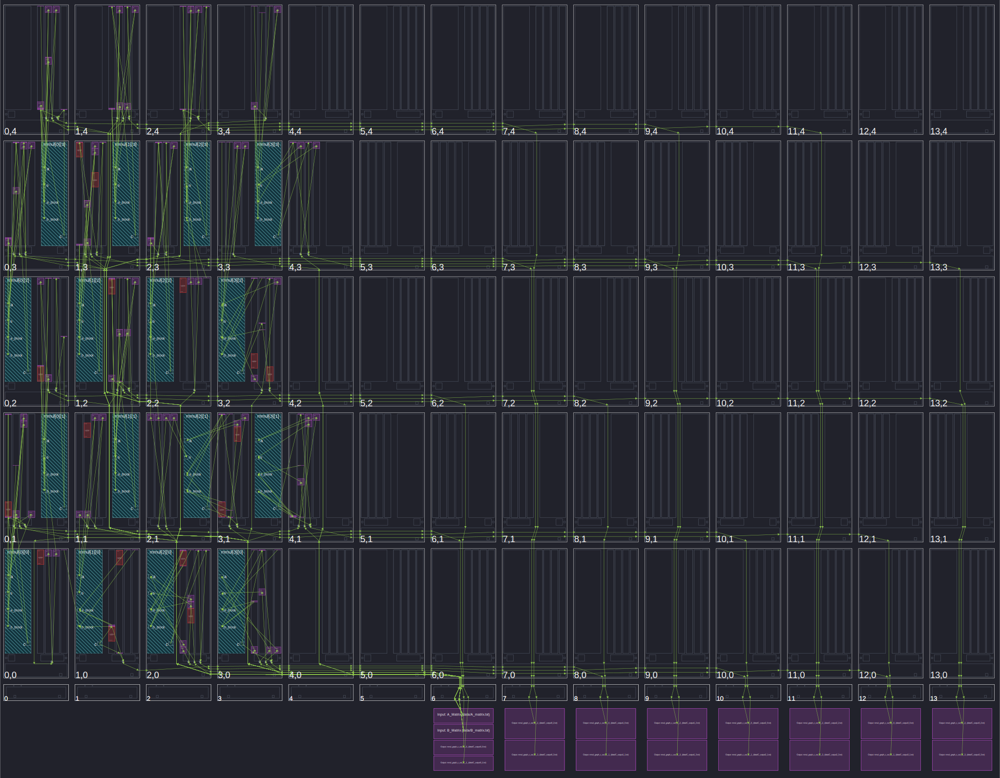

Simple Multi-Tile Matrix Multiplication (16x16x16)
====================================================

The mmul API class [1]_ offers 4x4x4 built-in matrix multiplication for int16. The following program calculates A*B=C where A, B, and C are matrices, and the computation is split across 16 tiles. Both 16x16 input matrices are split into 4x4 blocks. Within a block, row-major format is used. For matrix A, at the block-level, row-major format is used. For matrix B, a block-level column-major scheme is implemented.

.. list-table::
  :widths: 50 50
  :header-rows: 1

  * - Matrix A Traversal
    - Matrix B Traversal
  * - .. image:: ../images/A_matrix.png
         :alt: The tiling scheme is for the input matrix A
         :width: 300px
         :align: center
    - .. image:: ../images/B_matrix.png
         :alt: The tiling scheme is for the input matrix B 
         :width: 300px
         :align: center

Within a kernel, each corresponding block from A and B are multiplied and those partial results are summed together. The mmul class provides the ``mmul::mac()`` function with will perform acc = acc + A*B where acc is the (vectorized) values in the accumulator register corresponding to different sub-computations of the output matrix C.

Note that the AIE API docs provides a more general GEMM example kernel [2]_ for reference.

File structure:
::

  .
  ├── graph.hpp # Declaration of the graph
  ├── graph.cpp  # Initializes, runs, and ends the graph. 
  ├── kernels
  │   └── kernels.cpp # matmul kernel implementation
  └── kernels.hpp # declarations of kernel

Kernel Code (kernels.cpp)
****************************

The kernel performs 4x16x4 matrix multiplication for int16. There is no mmul class to accommodate the larger matrix size. Instead the computation is broken up into 4x4x4 multiplications and partial results are added together using ``mmul::mac()``.
The sizes provided by the mmul class are limited by the width of the accumulator register, which is by default 48 bits for int16. The a_block and b_block parameters are used to determine the offset of the larger A and B matrices where the kernel will read from. If a_block = 0 and b_block = 0, the kernel will read from the top left corner of the A and B matrices, and ultimately calculate the top left 4x4 block (C\ :sub:`00`\)  of the output matrix C.

The 4x16x4 kernel is duplicated across 16 tiles to calculate a 16x16x16 matrix multiplication in parallel.

Graph Code (graph.h)
*********************

Note that the graph code broadcast the A and B matrices to all tiles. The inputs are thus duplicated 16 times(!) in local tile memory. A more memory-efficient approache is discussed in the next section, but this serves as a simple reference example.

The graph code initializes the global PLIO streams for the input matrices A and B, and output matrix C. The input ports ``a_block_param`` and ``b_block_param`` are defined to determine the section of the matrix that a single kernel will compute. They are simular to threadIDs in GPU programming and play the same role. They are single scalar values which are translated to the `a_block` and `b_block` parameters in the kernel code. In the host code, we set this grid of parameters. 

Host Code (host.cpp)
*********************

The host code calls the graph and sets the hyper-parameters ``a_block_param`` and ``b_block_param``. They allow a kernel to know which block of the larger matrix it should compute.
These parameters are streamed in as initial data packets prior to the other data. These are static parameters that don't change during runtime. Alternative, cleaner ways to set these kernel parameters during compile-time are discussed in the next module.

AIE Grid Array View
****************************
AMD Vitis software simulation provides a grid view of the AIE array:

The 4x4 kernel grid is mapped to the bottom left corner of the AIE grid as specified in the graph code. Note the double buffering which is automatically applied from plio to local tile buffers. If double buffering will exceed the memory limit of the local tiles, you can disable it with ``single_buffer(port<T>&)`` [3]_.

.. rubric:: References
.. [1] AIE API mmul Class. https://docs.amd.com/r/en-US/ug1603-ai-engine-ml-kernel-graph/accumulate
.. [2] AIE API GEMM Example Kernel. https://www.xilinx.com/htmldocs/xilinx2023_2/aiengine_api/aie_api/doc/group__group__mmul.html
.. [3] AIE API single_buffer type. https://docs.amd.com/r/en-US/ug1079-ai-engine-kernel-coding/Buffer-Allocation-Control
