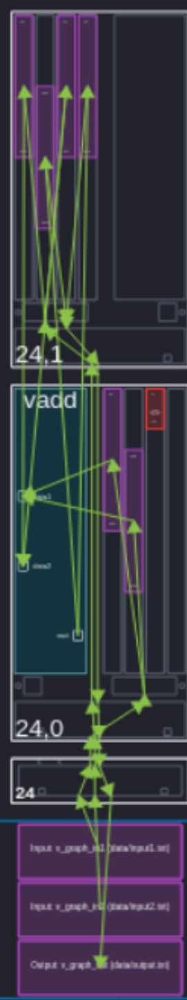

Vector Addition Example
=========================
-----------------
Second Example
-----------------

We also provide a second implementation of vector addition. In this example, we use ``aie::buffer`` instead of streams. This change to the dataflow type will store the entire input and outputs into the local tile memory so that it may be accessed all at once by the kernel. We also define iterating over inputs in the graph, not by running the graph 128 times, but using a vector iterator to access the local memory. Therefore instead of running the graph 128 times for each stream packet, we run it just once on the entire input vector.

As a result the ``aie::buffer`` has a higher pre-kernel overhead, because the kernel must wait for the entire buffer to be filled before it begins processing. However, it can be more efficient for larger data sets, as it reduces the overhead of repeatedly initializing the kernel with new data. [1]_

From Vitis hardware simulation, the first element of the vector to be calculated and written to plio was at 4435200 ps which means the initial data buffering took over 50% of the kernel runtime on a vector of 1024 elements. Whereas, when we use the stream datatype, the pre-kernel streaming of data is negligible, because the first element is processed and written to plio almost immediately. 

The stream datatype gave a quicker time to first element, which could be useful for real-time applications. However, the buffer datatype was marginally faster to process the entire vector (~200 ps), because it can exploit the parallelism of AIE processors more effectively.

The final array image shows us the usage of multiple tiles. Although the kernel runs in a single one, the usage of memory spreads throughout an adjacent tile.

-----------------
Summary
-----------------
Through vector addition, the differences between streams and buffers are explored.

+-----------------------+-----------------------------------------+-----------------------------------------+
| Metric                | Buffer                                  | Stream                                  |
+=======================+=========================================+=========================================+
| Latency               | Higher (wait for buffer fill)           | Lower (immediate processing)            |
+-----------------------+-----------------------------------------+-----------------------------------------+
| Throughput            | Higher (256-bit/cycle operations)       | Lower (32-bit/cycle operations)         |
+-----------------------+-----------------------------------------+-----------------------------------------+
| Best Use Case         | Large datasets, random access           | Real-time, low-latency apps             |
+-----------------------+-----------------------------------------+-----------------------------------------+

.. [1] AIE Docs: Buffer vs Stream, https://docs.amd.com/r/en-US/ug1079-ai-engine-kernel-coding/Buffer-vs.-Stream-in-Data-Communication
