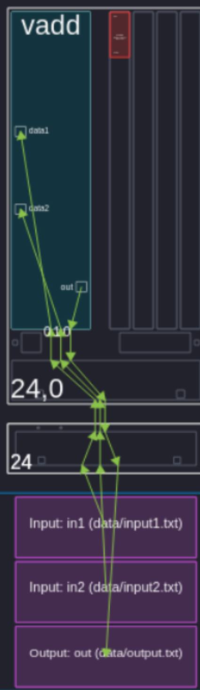

Vector Addition Example
=========================
-----------------
First Example
-----------------

Programming for the AIE is highly parallel. While one can designate kernels to individual AI Engines, the data movement outside of it is usually considered via a data graph. While there are different languages and standards one can use for these graphs, our examples employ C++ for the kernels and the graphs using the AMD Vitis compiler. Here is an example of the filestructure that is seen:

::

  .
  ├── graph.hpp # Used for the graph
  ├── host.cpp  # Initializes, runs, and ends the graph. 
  ├── kernels
  │   └── vadd_stream.cc # kernel definitions
  └── kernels.hpp # definition of kernel

Although the naming convention is not necessarily the most relevant, Vitis needs to know what is your main file. In the settings, ``vitis-comp.json``, of the project, appoint ``host.cpp`` as the Top-level File.

We will take a look inside the files for how we define the graph and call the kernel.

Our Top-level File will initialize our graph and control the times it is ran. But the definition of the dataflow itself is stored in ``graph.hpp``.

The dataflow graph is a class that extends the graph functionality. It can be made up of a multiple kernels, snippets of code that will run on the AIE tiles. While multiple kernels can run per tile, a kernel is not split between tiles. 

Our graph itself must define the data flow before it is ready to call on the kernels. In our implementation we use ``input_plio`` to stream our data from our ``plio`` memory to connect to the inputs of our kernel. We also need to specify the dimensions of our types from our inputs as well as our outputs. We use a ``stream`` to tell Vitis that we want to load via the stream interface and run the graph for 128 samples. After we will look at an alternative implementation that uses buffers instead of streams.

The definition of the our ``aie_vadd_stream()`` kernel. It takes in a stream of int32, which is specified by the architecture, places it into a vector of size 4 of types ``int32``, and then uses functions to read continually from the stream and calculate the addition of both streams, storing it into the output stream.

Vitis's analyzation is very useful to looking at the synthesized dataflow. Our final array view shows how the plio blocks stream into the AIE itself and streams the results back into an output. Notice that it does not use any of the tile's local memory.

-----------------
Summary
-----------------
Through vector addition, the differences between streams and buffers are explored.

+-----------------------+-----------------------------------------+-----------------------------------------+
| Metric                | Buffer                                  | Stream                                  |
+=======================+=========================================+=========================================+
| Latency               | Higher (wait for buffer fill)           | Lower (immediate processing)            |
+-----------------------+-----------------------------------------+-----------------------------------------+
| Throughput            | Higher (256-bit/cycle operations)       | Lower (32-bit/cycle operations)         |
+-----------------------+-----------------------------------------+-----------------------------------------+
| Best Use Case         | Large datasets, random access           | Real-time, low-latency apps             |
+-----------------------+-----------------------------------------+-----------------------------------------+

.. [1] AIE Docs: Buffer vs Stream, https://docs.amd.com/r/en-US/ug1079-ai-engine-kernel-coding/Buffer-vs.-Stream-in-Data-Communication
